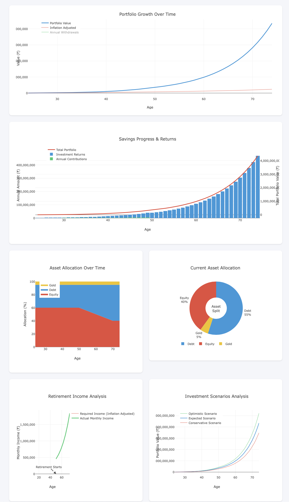

# InvestMore

A comprehensive investment portfolio management and analysis tool that helps users make informed investment decisions.


## Screenshots

### Dashboard


### Portfolio Analysis
](https://github.com/Arshad221b/InvestMore/blob/main/screenshots/Screenshot%202025-01-05%20at%209.11.09%E2%80%AFPM.png)

## Contributing

Add your own features, fix bugs, improve the code, etc.


## Deployment

### Heroku Deployment

1. Create a Heroku account and install the Heroku CLI

2. Login to Heroku
```bash
heroku login
```

3. Create a new Heroku app
```bash
heroku create investmore-app
```

4. Deploy to Heroku
```bash
git push heroku main
```

Visit your deployed application at: https://investmore-app.herokuapp.com


I created this project just to track my own investments and to learn more about the technologies I'm interested in. Nothing more, nothing less. :)